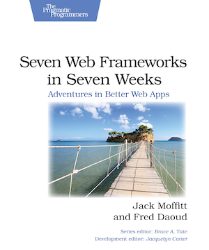

[](https://gitpitch.com/enogrob/ebook-project/master)
```
Roberto Nogueira  
BSd EE, MSd CE
Solution Integrator Experienced - Certified by Ericsson
```
# eBook Seven Web Frameworks in Seven Weeks



**About**

Learn everything you need to about the subject of this `eBook` project.

[Homepage](https://pragprog.com/book/7web/seven-web-frameworks-in-seven-weeks)

## Topics
```
Preface
Sinatra
[ ] A Simple Domain-Specific Language
[ ] Day 1: Building a Bookmarking Application
[ ] Day 2: Creating Views
[ ] Day 3: Adding Features
[ ] Wrapping Up
CanJS
[ ] What Makes CanJS Unique?
[ ] Day 1: Building Objects and Synchronizing Changes excerpt
[ ] Day 2: Creating Controllers
[ ] Day 3: Working with Models
[ ] Wrapping Up
AngularJS
[ ] The Big Picture
[ ] Day 1: Using Dependency Injection
[ ] Day 2: Creating Controllers and Views
[ ] Day 3: Building Filters and Routes
[ ] Wrapping Up
Ring
[ ] Introducing Ring
[ ] Day 1: Basic Towers
[ ] Day 2: Patterns of Bricks
[ ] Day 3: Other Ways to Build excerpt
[ ] Wrapping Up
Webmachine
[ ] Introducing Webmachine
[ ] Day 1: HTTP Request as State Machine
[ ] Day 2: Building Apps excerpt
[ ] Day 3: Illuminating HTTP’s Dark Corners
[ ] Wrapping Up
Yesod
[ ] Immutant
[ ] Wrap-Up
```
